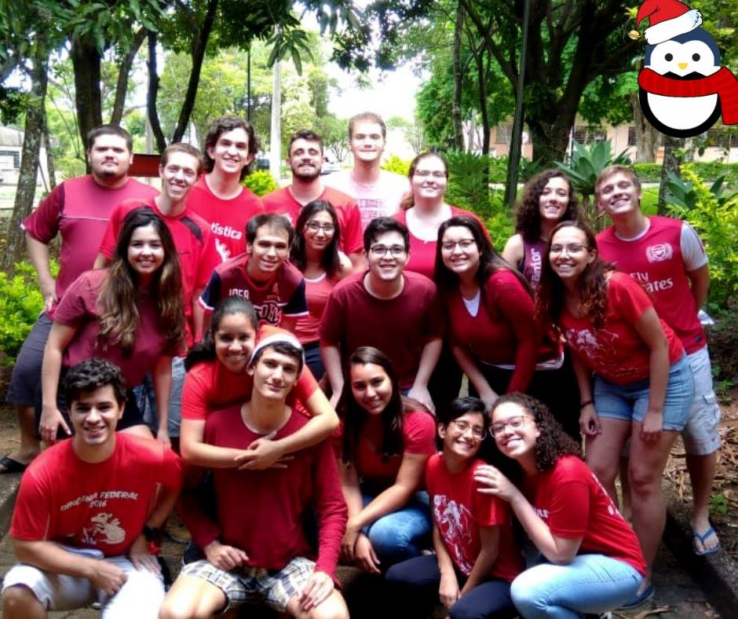

Meu currículo em português pode ser acessado [aqui](cv/cv-victordogo.pdf).

My english CV can be accessed [here](cv/cv-en-victordogo.pdf).

Olá! Meu nome é Victor Dogo, atualmente estudante rumo ao título de Bacharel em Estatística pela UFSCar - Universidade Federal de São Carlos. Sou especialmente interessado em programação estatística usando R (foco de boa parte do que eu for postar aqui), mas aberto a muitas outras aplicações (atualmente, procurando aprender Julia).

Neste site, procurarei manter informações relativas aos projetos em que eu esteja participando, posts interessantes que eu venha a escrever ou outras coisas igualmente interessantes mas que eventualmente não sejam relacionadas à Estatística ou Ciência de Dados.

# `r fontawesome::fa(name="graduation-cap")` Formação Acadêmica

Sou graduando do curso de Estatística na UFSCar - Universidade Federal de São Carlos, campus São Carlos, ingresso em 2017. Foi aqui que me descobri como uma pessoa apaixonada por uma mentalidade data-driven e por técnicas que possam aprofundar nossos conhecimentos e decisões através de técnicas sólidas baseadas em estatística e ciência de dados.

Fiz parte da comissão organizadora da Semana da Estatística UFSCar/USP entre 2017 e 2021, bem como parte da equipe de operações da EJE - Empresa Júnior de Estatística da UFSCar. Estes dois projetos me deram uma noção importantíssima de como a base teórica que temos em sala de aula se aplica em contextos dos mais diversos, desde pesquisas acadêmicas até aplicações no mercado financeiro.

# `r fontawesome::fa(name="people-carry")` Voluntariado

Faço parte da Ordem DeMolay desde 2014 até os dias de hoje. Meu tempo tanto como membro ativo (2014-2020) e membro sênior (2021-atualmente) me trouxe um panorama importante da necessidade de uma mentalidade voltada ao social para qualquer situação em que nos encontramos. Aqui fiz irmãos, ajudamos pessoas e instituições de nossa cidade, assim fazendo crescer minha consciência e maturidade para o mundo.

# `r fontawesome::fa(name="smile-beam")` Hobbies

### `r fontawesome::fa(name="book")` Leitura

* Amo ler qualquer tipo de coisa, desde que a escrita seja cativante e bem feita, me prendendo do começo ao fim;
* **Livros Favoritos:** "Estação Carandiru" (Dráuzio Varella), "Estarão as prisões obsoletas?" (Angela Davis), "O Hobbit" (J.R.R. Tolkien), "Battle Royale" (Koushun Takami).

### `r fontawesome::fa(name="gamepad")` Jogos

* Sou apaixonado por jogos desde muito pequeno. Meu gosto tende pra RPGs, jogos de aventura, metroidvanias e correlatos;
* **Jogos Favoritos:** Bravely Default, Metroid Dread, Pokémon Black, The Legend of Zelda: Breath of the Wild, Stardew Valley e Skyrim.

### `r fontawesome::fa(name="dice-d20")` RPGs de Mesa

* Ainda que este hobby esteja meio largado, gosto muito de RPGs de Mesa (sendo mestre ou jogador);
* **Sistemas Favoritos:** D&D 5e, Terra Devastada, Tiny Dungeon e (futuramente) Avatar Legends.

### `r fontawesome::fa(name="music")` Música

* Como 99,99% da população mundial, escuto música de vez em quando, e adoro fazer isso enquanto relaxo, faço tarefas domésticas ou estudo (aceito indicações, inclusive!);
* **Gêneros Musicais Favoritos:** Power/Thrash/Death Metal, City Pop, Vaporwave, Sertanejo e Trilhas Sonoras.
